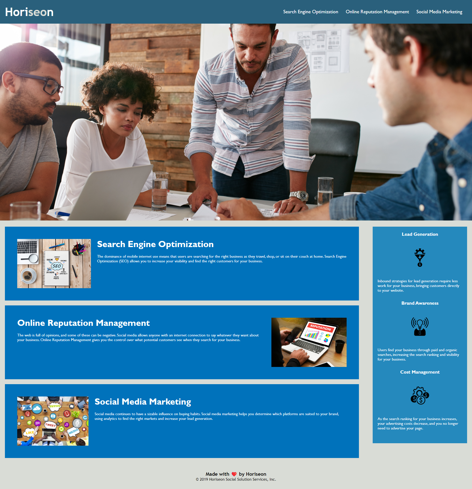

# Horiseon Restructure

## Technology Used 

| Technology Used         | Resource URL           | 
| ------------- |:-------------:| 
| HTML    | [https://developer.mozilla.org/en-US/docs/Web/HTML](https://developer.mozilla.org/en-US/docs/Web/HTML) | 
| CSS     | [https://developer.mozilla.org/en-US/docs/Web/CSS](https://developer.mozilla.org/en-US/docs/Web/CSS)      |   
| Git | [https://git-scm.com/](https://git-scm.com/)     |    

## Description 

[Visit the Deployed Site](https://jarell-chinn.github.io/Jarell-Chinn-Horiseon-Digital-Marketing-Restructure/)

The client needed a restructure of the unsemantic website given. It had many problems with way too many div tags and a lot of repeated code on the style sheet.
I fixed this by getting rid of all the div tags and replacing them with more descriptive tags such as "header", "main", "section", ect. I also configured the style sheet accordingly and I changed the repetitive classes into one class to avoid retyping the same code.


## Code Refactor Example

What are the steps required to install your project? Provide a step-by-step description of how to get the development environment running.


```html
<div class="header">
        <h1>Hori<span class="seo">seo</span>n</h1>
        <div>
            <ul>
                <li>
                    <a href="#search-engine-optimization">Search Engine Optimization</a>
                </li>
                <li>
                    <a href="#online-reputation-management">Online Reputation Management</a>
                </li>
                <li>
                    <a href="#social-media-marketing">Social Media Marketing</a>
                </li>
            </ul>
        </div>
    </div>
```

Converting the above non-semantic div with the class of 'header' to an appropriate [<header> semantic element](https://www.w3schools.com/html/html5_semantic_elements.asp). 

```html
<header>
        <h1>Hori<span class="seo">seo</span>n</h1>
        <nav>
            <ul>
                <li>
                    <a href="#search-engine-optimization">Search Engine Optimization</a>
                </li>
                <li>
                    <a href="#online-reputation-management">Online Reputation Management</a>
                </li>
                <li>
                    <a href="#social-media-marketing">Social Media Marketing</a>
                </li>
            </ul>
        </nav>
    </header>

```

This change require some additional modification to the CSS selector: 

```css
.header {
    padding: 20px;
    font-family: 'Trebuchet MS', 'Lucida Sans Unicode', 'Lucida Grande', 'Lucida Sans', Arial, sans-serif;
    background-color: #2a607c;
    color: #ffffff;
}
```

No longer targeting the element on the page with the class of 'header' but instead the css selector targeting the 'header' element 

```css
header {
    padding: 20px;
    font-family: 'Trebuchet MS', 'Lucida Sans Unicode', 'Lucida Grande', 'Lucida Sans', Arial, sans-serif;
    background-color: #2a607c;
    color: #ffffff;
}

```

## Usage 
Nothing about the user side changed works exactly the same as before here is the end result that matches the start.




## Learning Points 

I learned the semantic structure of a .html in this project.
I also got a much better understanding on how css connects to .html through classes and id’s.
I did have a problem trying to create a new class to replace some repeated code but I’m happy to say that I figured it out and was able to make it look very nice.


## Author Info 

* [LinkedIn](https://www.linkedin.com/in/jarell-chinn-517307220/)
* [Github](https://github.com/Jarell-Chinn)